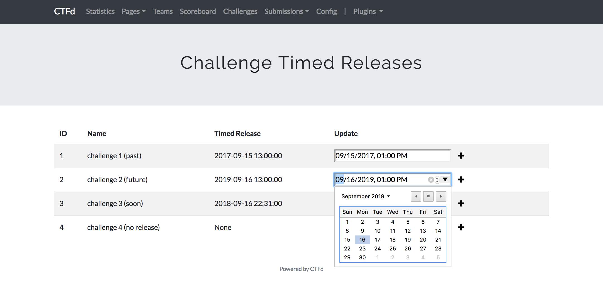

# Timed Releases
Adds timed releases to CTFd challenges.

Participants can see when a challenge will be released. The challenge's data will only be visible once the time has
elapsed.

This plugin has been tested with CTFd version 1.2.0. It is recommended to combine this plugin with
DynamicValueChallenge.




## Install

1. Clone this repository to your CTFd installation under `CTFd/plugins/`.
2. Update your theme to render the countdown (see sample patch below for the default theme).
3. Start/restart your ctfd instance.
4. Thats it. At this point you should find a plugin menu item called "Challenge Timed Releases" under your admin panel.
   From there you can set (or remove) the release time for a challenge.

## Patch for the default theme

```
diff --git a/CTFd/themes/core/static/js/chalboard.js b/CTFd/themes/core/static/js/chalboard.js
index f7b6764..777fad3 100644
--- a/CTFd/themes/core/static/js/chalboard.js
+++ b/CTFd/themes/core/static/js/chalboard.js
@@ -284,7 +284,10 @@ function loadchals(cb) {
                 chalwrap.addClass(tag);
             }

+            var seconds_before_release = $("<p><span class='countdown' data-time='{0}'>&nbsp;</span></p>".format(chalinfo.seconds_before_release))
+
             chalbutton.append(chalheader);
+            chalbutton.append(seconds_before_release)
             chalbutton.append(chalscore);
             chalwrap.append(chalbutton);

```

## Limitations

* Only supports timed releases of the challenges. Hints aren't supported.
* Once set, a timed release can't be removed. A workaround is to set the date in the past or manually edit the database.
* This plugin doesn't play nice with plugins which extend Challenge. E.g. don't use it with DynamicValueChallenge.

## Developer notes

This plugin's code was written by forking [ctfd-challenge-dependencies](https://github.com/narhen/ctfd-challenge-dependencies).

We tried to keep the same philosophy of making the plugin as un-intrusive as possible.

No pre existing database tables are manipulated. But a new table `timed_releases` is added.
